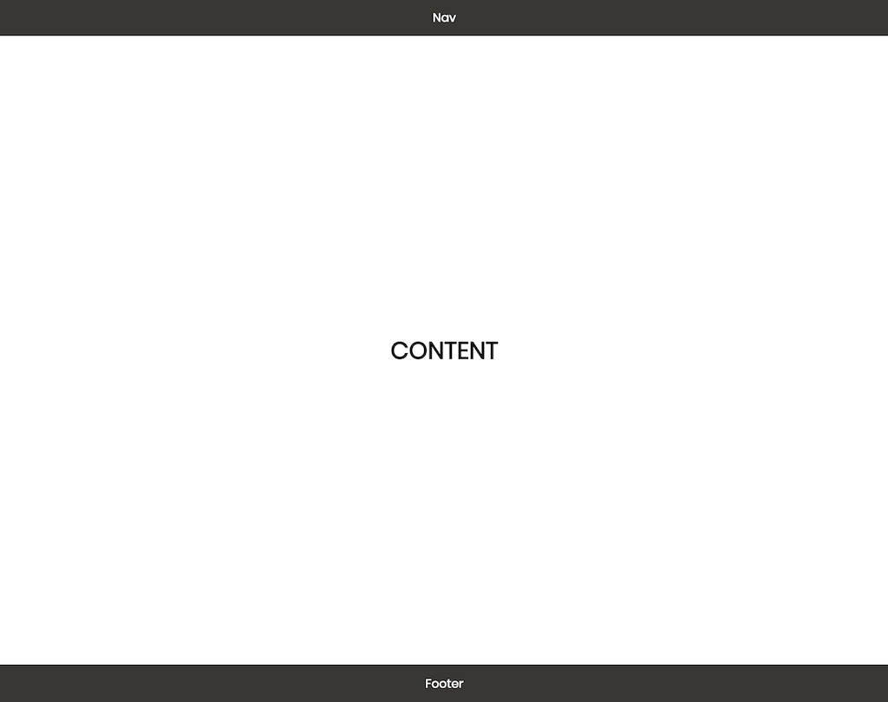
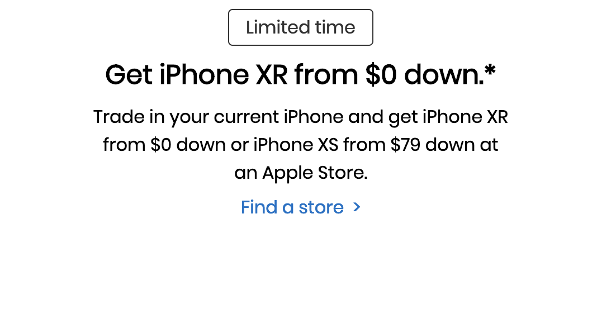
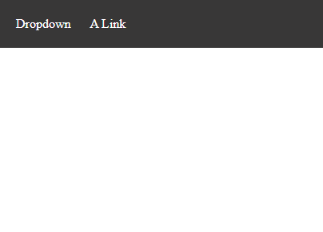
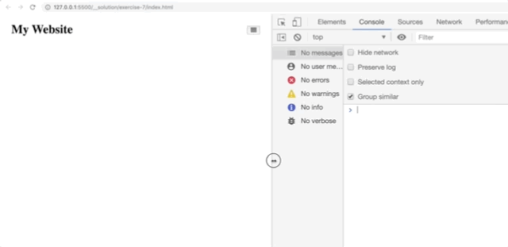
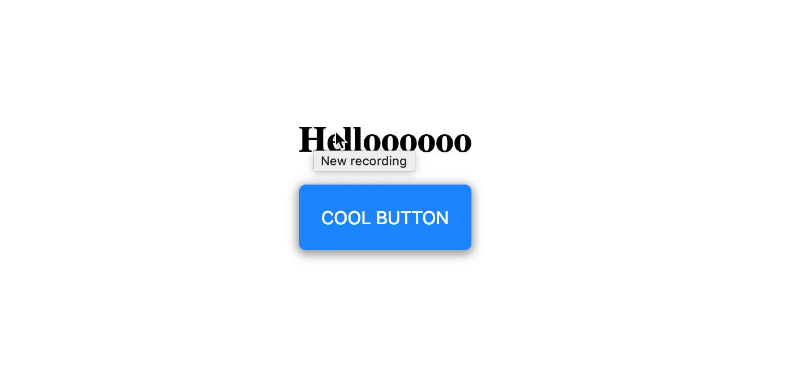

# CSS: Page Layout - Workshop

## 🦊 Pre-lecture

⏲️ _Estimated time required: 15 to 30 minutes._

Open the [README](./pre-lecture/README.md) in the `pre-lecture` folder. Follow the instructions and complete the activity.

---

## 🦉 Lecture

- [Lecture 1 | Page Layout](./lecture/lecture-1-page-layout.md)

---

## ⚡ Exercises

**Each exercise folder contains a `README` with additional documentation.**

## [Exercise 1](./workshop/exercise-01/) - Use Flexbox

Create an `index.html` file and a `style.css` file that reproduces the following:

## [Exercise 2](./workshop/exercise-02/)

Create an `index.html` file and a `style.css` file that reproduces the following:

## [Exercise 3](./workshop/exercise-03/)

Create an `index.html` file and a `style.css` file that reproduces the following:

This is a full screen background image with text in the center

## [Exercise 4](./workshop/exercise-04/)

Create an `index.html` file and a `style.css` file that reproduces the following:

## [Exercise 5](./workshop/exercise-05/)

Create an `index.html` file and a `style.css` file that reproduces the following:

## [Exercise 6](./workshop/exercise-06/)

Only update `style.css` file to reproduce the following:

## [Exercise 7](./workshop/exercise-07/)

Only update the `style.css` file to reproduce the following:

---

🟡 - Minimally complete workshop (75%) - 🟡

---

## [Exercise 8](./workshop/exercise-08/)

Only update `style.css` file to reproduce the following:

## [Exercise 9](./workshop/exercise-09/)

Only update `style.css` file to reproduce the following:

## [Exercise 10](./workshop/exercise-10/)

Create an `index.html` file and a `style.css` file that reproduces the following:

---

🟢 - Complete workshop (100%) - 🟢

---

## Stretch Goals

The exercises in the following links will help you get more practice with CSS selectors, CSS Flexbox, and optionally Grid.

### [Exercise 11](./workshop/exercise-10/)

Go back to exercise 10 and make the button do a 360deg rotation when it bounces

- Use the syntax `transform:scale() rotate()` in your keyframe

### [Exercise 12](./workshop/exercise-12-stretch/) - NO flexbox!

The very first exercise had us build this:

For fun, try and build this _without_ using flexbox. No `display: flex` allowed.

You will need to use `calc()` and `vh` units for this.

Example use: `min-height: calc(10vh + 200px);`
