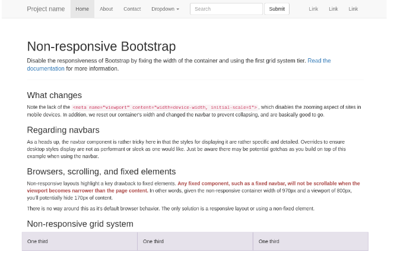
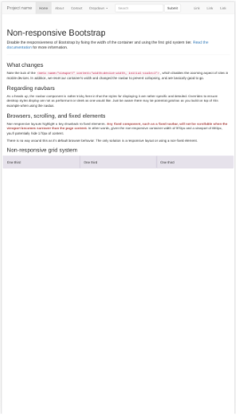
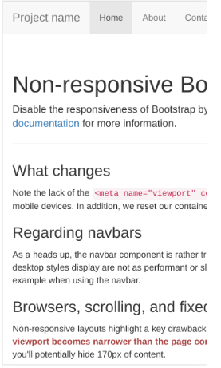
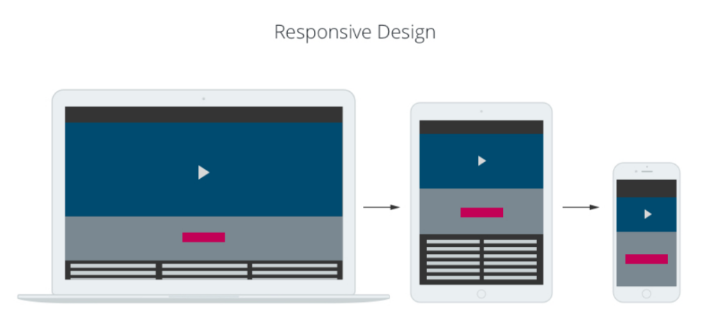
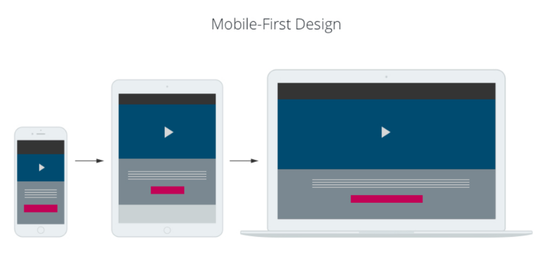

# Page Layout

---

## CSS Pixels

- Your monitor is divided into pixels (screen pixels.)
- When you write CSS, you specify dimension and position in `px` units.

❗ This `px` unit is **NOT** a screen pixel, but a CSS pixel.

---

## CSS Pixels

Different screens and their resolutions:
- Small laptop resolution: 1366 x 768
- "1080p" resolution: 1920 x 1080
- iPhone X screen resolution: 2436 x 1125

"Retina display": Fancy Apple branding term that means that every normal pixel is made up of 4 pixels.

---

## CSS Pixels

Example of a desktop site



---

## CSS Pixels

The same site on a mobile device



---

## CSS Pixels

A quick fix is to add this line to your HTML:

```html
<meta name="viewport" content="width=device-width, initial-scale=1.0" />
```

This will make the CSS pixels scale on mobile devices.

---

## CSS Pixels



---

## Viewable on all screens!

- Whatever you build will most likely need to be viewable on all kinds of screens.
- Websites shift content around depending on the screen size.

The [Montreal Gazette](https://montrealgazette.com/) is a good example of this. How do we go about building this fluidity into our web apps?
- Enter responsive and mobile-first.

---



---



---

## CSS Media Queries

How do we implement this responsive deisn? With media queries!

Media queries can be used to check many things:
- Width and height of the viewport
- Width and height of the device
- Orientation (landscape / portrait)
- Resolution

---

## Mobile-first Please!

In general, we recommend adopting a mobile-first philosophy.

How do we do this?
1. Write all of the CSS for a mobile version.
2. Increase the viewport to the next viewport width.
3. Add CSS (within a media query) to override the base CSS.
4. Repeat steps 2 and 3 as you move the next biggest viewport.

---

## Exercises!

Let's practice some media queries!

- [Exercise 1](https://codepen.io/gnomecircle/pen/VwKgQQE)
- [Exercise 2](https://codepen.io/gnomecircle/pen/poEGaKN)
- [Exercise 3](https://codepen.io/gnomecircle/pen/vYXbdaP)

---

## CSS Viewport Units

There are many units in CSS. These could definitely be useful:
- vh: percentage of the viewport height
- vw: percentage of the viewport width

```html
<p class="saying">Where is my bacon?!</p>
```

```css
.saying {
    background: red;
    color: white;
    height: 100vh;
    width: 100vw;
}
```

[Check it out!](https://codepen.io/gnomecircle/pen/MWjLVer)

---

## CSS Pseudo Selectors

A CSS pseudo-class is a keyword added to a selector that specifies a special state of the selected element(s).

For example, `:hover` can be used to change a button's color when the user's pointer hovers over it. [Check it out!](https://codepen.io/gnomecircle/pen/rNMPJEJ)

```html
<button class="btn">Click!</button>
```

```css
.btn {
    background: red;
    color: white;
    padding: 10px 14px;
}

.btn:hover {
    background: yellow;
    color: black;
}
```
---

## CSS Pseudo Selectors

Other popular pseudo selectors:
- :hover
- :focus
- :checked
- :first-child

You can find more [here](https://developer.mozilla.org/en-US/docs/Web/CSS/Pseudo-classes#Index_of_standard_pseudo-classes)

---

## CSS Reset

Browsers have their own style by default. This is fine most of the time until:
- The browser’s style interferes with ours.
- The browser’s style overwrites ours.

As programmers, we don’t like it when things interfere with our code. To put the browser in its place, we use what is known as a CSS reset:

https://meyerweb.com/eric/tools/css/reset/

Copying the code in this link at the top of our CSS file will remove the browser’s default styles and set everything to 0.